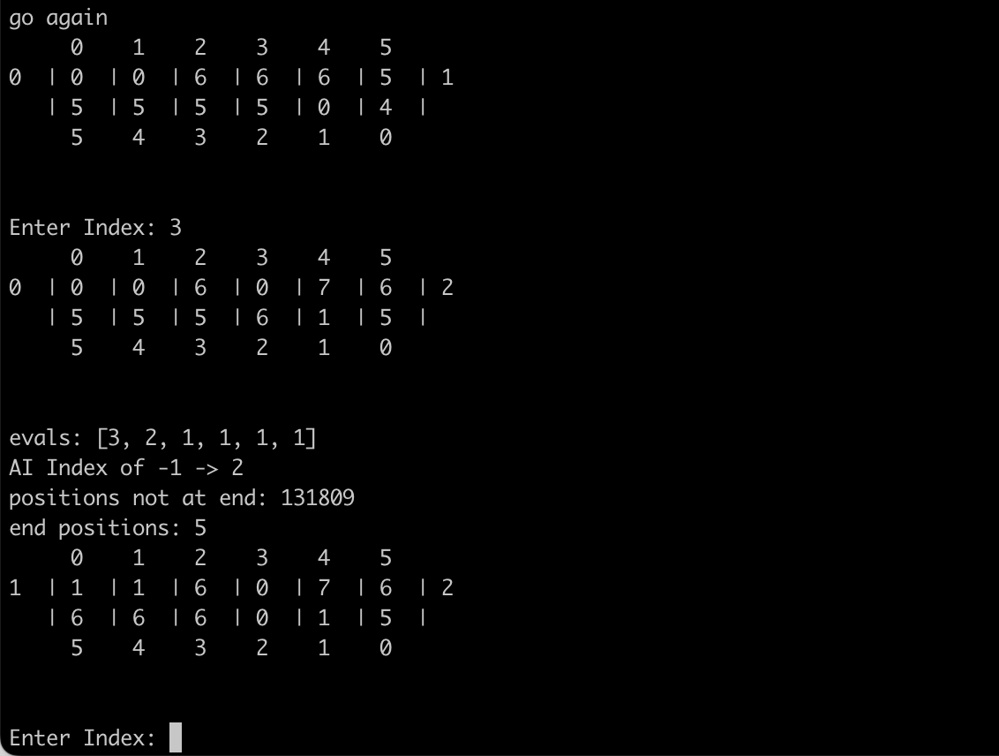

# mancala
Text based [mancala board game](https://en.wikipedia.org/wiki/Mancala).  User selects which position to move and the game calculates the move and new counts of pebbles.  User plays against an AI, which is implemented using a min-max algorithm.

